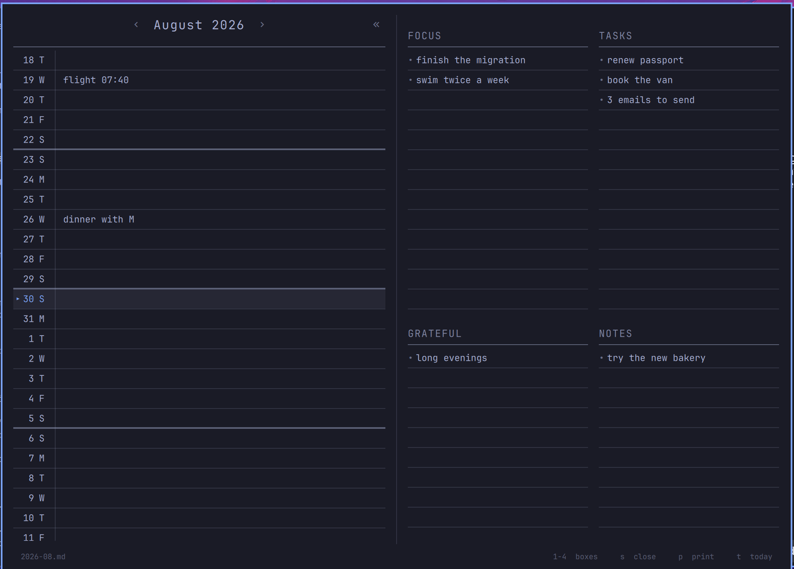
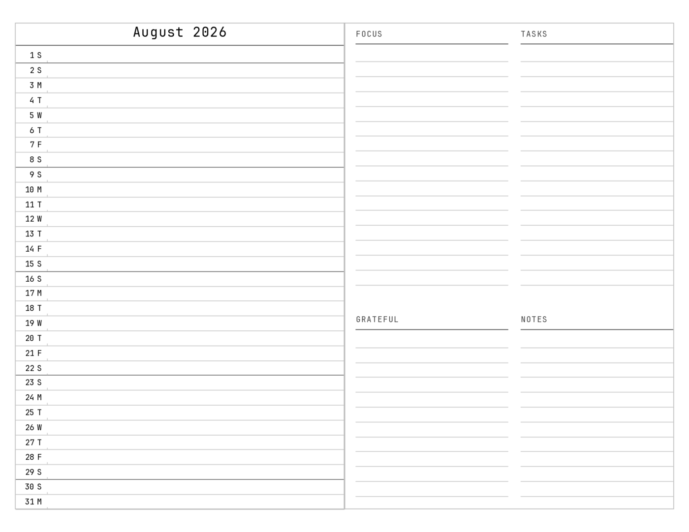

# Monthly Calendar

A bullet journal monthly calendar for the [Omarchy](https://omarchy.org) shell bar.

One ruled line per day, labelled with the date and its weekday initial, with a
heavier rule closing every week — the paper original, typed into rather than
written on. The days run continuously, so the end of one month flows straight
into the next instead of stopping at a page break.

Each month is kept as a plain Markdown note in your Obsidian vault, so the same
log is editable from either side: type in the bar, or open the note and edit it
in Obsidian, and both stay in step.



## Install

```bash
omarchy plugin add https://github.com/Windswell284/omarchy-journal --enable
```

You will be asked which bar section to place it in. That gets you the bar icon
and the panel; **keys are a separate step** -- see [Keybindings](#keybindings).

It installs under the id
`pyang.journal` -- that is the name to use in `shell.json`, in `omarchy plugin`
commands and in IPC calls.

```bash
omarchy plugin update pyang.journal     # pull later changes
omarchy plugin disable pyang.journal    # take it off the bar
```

## Where the notes go

By default, one note per month at:

```
~/Documents/Obsidian/Monthly Calendar/2026-08.md
```

**If your vault is somewhere else, point it there** in
`~/.config/omarchy/shell.json` — find the `pyang.journal` entry in the bar
layout and add `vault` and `folder`:

```json
{ "id": "pyang.journal", "vault": "/home/you/Notes", "folder": "Journal" }
```

`shell.json` hot-reloads on save, so the change applies immediately. The folder
is created if it does not already exist, at the path in force once the entry
has been read -- so moving the vault makes the new folder rather than leaving
an empty one behind at the old path.

## The note format

Every day of the month is written, not just the filled ones, so the note reads
as a log and you never have to guess where a day belongs:

```markdown
# August 2026

- **1 S**
- **2 S** dentist 3pm
- **3 M**
- **4 T** ship v2
```

Parsing is lenient on the way back in: the bold markers and the weekday letter
are both optional, so a line typed by hand in Obsidian as `- 4 ship v2` still
lands on the 4th. Bullets that do not start with a day number are left alone.

## Keys

| Key | Does |
| --- | --- |
| `Left` / `Right`, `h` / `l` | Previous / next month |
| `Up` / `Down`, `j` / `k` | Move a day — carries across month boundaries |
| `Enter` | Start writing on the current day; again moves to the next |
| `Tab` / `Shift+Tab` | Leave the day log for the facing page's first / last box — whether or not you are writing |
| `Esc` | Stop writing, or close the panel |
| `t` | Jump back to today |
| `[` / `]` | Previous / next month |
| `{` / `}` | Previous / next year |
| `1` `2` `3` `4` | Jump into a facing-page box |
| `Enter` / `Up` / `Down` | Move between lines inside a box |
| `Tab` / `Shift+Tab` | Next / previous section — the day log, then Focus, Tasks, Grateful, Notes, wrapping |
| `p` | Print the month on screen as a cut-out spread |
| `s` | Sync with Google Calendar now |

The wheel scrolls the days continuously. Clicking the month name returns to
today; the chevrons either side of it step a month at a time. The circular
arrow at the right of the heading syncs on the spot, and the footer says how
long ago the last sync was, whoever started it.

The heading names the month you are in: the one under the middle of the view
while you scroll, and the one the cursor is on the moment a key moves it, so
stepping off the 31st onto the 1st turns the heading over with it. It is shown
at full strength for the current month and slightly dimmed for any other.

## Keybindings

**`omarchy plugin add` does not set up keys.** It places the widget in the bar
and stops there: the plugin manifest has no way to declare a binding, and
nothing in the install path touches Hyprland. So after installing, the bar icon
works and every key inside the panel works, but nothing summons it.

To add the bindings:

```bash
cd ~/.config/omarchy/plugins/pyang.journal
./install-bindings          # SUPER+M
./install-bindings --remove  # take it out again
```

It backs `bindings.lua` up first, refuses rather than double-binding if the
key is already spoken for, and reloads Hyprland, failing loudly if the reload
reports a config error. Running it twice is a no-op.

Or add it yourself, to `~/.config/hypr/bindings.lua`:

```lua
o.bind("SUPER + M", "Monthly calendar", "omarchy-shell pyang.journal toggle")
```

## The facing page

A monthly spread is two pages. The right one holds four boxes for the month as
a whole -- Focus and Tasks on the taller top row, Grateful and Notes
beneath. Both pages are up whenever the panel is: the spread is the unit, and
there is no one-page state to fold back to. The boxes follow whichever month
the heading names.

They are stored in the same monthly note, under `## ` headings after the days:

```markdown
## Focus

- ship v2

## Tasks

- 3 emails to send
```

Section lines are stored as Markdown list items, so they render as a list in
Obsidian. The marker is punctuation rather than content: it is stripped on the
way in and put back on the way out, so it never doubles up, and a line typed
with its own `-` or `*` is not marked twice.

Note that a bullet like `- 3 emails to send` sits under a heading and is *not*
read back as the 3rd of the month: the note is split at its first `## ` heading
and days are only parsed above it.

IPC methods, for binding to keys: `open`, `close`, `toggle` -- e.g.
`omarchy-shell pyang.journal toggle`. `spread`, `toggleSpread` and
`toggleWithSpread` are older names from when the facing page could be shut on
its own; they still work, as `open` and `toggle`.

## Google Calendar

`journal-sync` keeps the monthly note and a Google Calendar in step, in both
directions. The note is the thing you type in; the calendar is the thing you
read on your phone. Either may be edited, and the sync works out which side
moved by comparing both against what they agreed on at the end of the last run.

It also means the note reaches your other devices without Obsidian being open.
Obsidian Sync runs inside the Obsidian app, so a note written from the bar sits
on disk until you next launch it; `journal-sync` is a plain script on a timer
and has no such requirement.

### What crosses over, and what does not

Titles are passed through exactly as typed, in both directions. `dinner RHCC`
goes to the calendar as `dinner RHCC` and comes back as `dinner RHCC`. Nothing
guesses at your abbreviations, capitalises your names or rewrites your wording.

The **time** is the part that is translated, because that is the part the two
sides genuinely disagree about. A journal line writes it as text at the front
of the entry; a calendar wants a structured start and end:

| In the note | On the calendar |
| --- | --- |
| `1 pm Panza` | 13:00-14:00, "Panza" |
| `2:15 pm David` | 14:15-15:15, "David" |
| `9:30 am-11 am review` | 09:30-11:00, "review" |
| `17:30 dinner` | 17:30-18:30, "dinner" |
| `To Beijing` | all day, "To Beijing" |

A time with no `am` or `pm` is read as a 24-hour clock, so `5:30 dinner` is
half past five in the *morning*. Write `5:30 pm` or `17:30` for the evening.

### One line, several entries

A comma separates entries, always:

| In the note | On the calendar |
| --- | --- |
| `1 pm A, 2 pm B` | two events |
| `Salvation` | one all-day event |
| `5:30 pm dinner, Salvation` | dinner at 17:30, Salvation 18:30-19:00 |
| `Salvation, 5 pm Dad` | Salvation all day, Dad at 17:00 |

An entry with no time of its own is **all-day only where it opens the line**.
Anywhere else it starts where the entry before it finished and runs for half an
hour -- a block rather than an appointment, so several in a row still fit in an
evening. If the entry before it was all-day too, or its block would not fit
inside the day, there is nothing to follow and it stays all-day.

The time it is given is **not written back into the note**. The entry stays
timeless there and is placed again on every read, so putting something new in
front of it moves it along instead of stranding it at an hour you never asked
for:

```
5:30 pm dinner, Salvation                 Salvation 18:30-19:00
5:30 pm dinner, 7 pm movie, Salvation     Salvation 20:00-20:30
```

Because every comma separates, **a title cannot contain one**. A calendar event
called `Dinner, 7 pm at the club` is written into the note as
`Dinner; 7 pm at the club` -- a semicolon reads the same and separates nothing.
The calendar keeps its comma; only the note's rendering changes, and the two
are compared in the note's alphabet so this never counts as an edit.

and back the other way, so an event you move to 4pm on your phone reappears in
the note as `4 pm`. A line with no time is an all-day event, and an all-day
event comes home with no time.

An entry with no explicit end runs for an hour, so `1 pm` and `1-2 pm` mean the
same thing and are written the same way. A longer range is kept as you wrote
it.

### The glossary, if you ever want it

There is an optional lookup table for expanding shorthand into fuller titles --
`RHCC` to `Rolling Hills Country Club` on the way out, and back again on the
way in. **It is empty by default and changes nothing until you add to it.**

```bash
journal-sync glossary set RHCC 'Rolling Hills Country Club'
journal-sync glossary set 'dinner RHCC' 'Dinner at Rolling Hills' --phrase
journal-sync glossary list
```

A **term** is replaced wherever it appears as a whole word; a **phrase** matches
a whole title and wins over any term. Because the same table runs backwards, a
title retyped on your phone still comes home as shorthand.

`journal-sync suggest` will propose entries: it shows Claude the lines each
unfamiliar word appears in and asks it to expand only from evidence, refusing
where the meaning is genuinely private. `--apply` writes the confident ones.
It is an authoring aid for a table you own, not a step in the sync -- nothing
Claude proposes reaches the calendar without you accepting it first.

### Setting it up

```bash
sudo pacman -S python-google-api-python-client python-google-auth-oauthlib
```

Google needs an OAuth client of your own -- there is no shared one to borrow:

1. At [console.cloud.google.com](https://console.cloud.google.com), make a project.
2. Enable the **Google Calendar API** for it.
3. Under **APIs & Services -> OAuth consent screen** (newer consoles call this
   **Google Auth Platform**), set it up as *External*. The app name and contact
   addresses are only ever shown to you.
4. On that same screen, **publish the app**. This matters more than it looks:
   while the publishing status is *Testing*, Google expires refresh tokens
   after **seven days**, so the sync works for a week and then quietly stops
   until you authorise again. Publishing removes the expiry, at the cost of an
   "unverified app" warning at sign-in that you click past with *Advanced -> Go
   to ... (unsafe)*. It is your own app, your own account, and a scope that
   reaches nothing but the calendar it made. If you would rather not publish,
   add yourself under *Test users* and expect to re-run `journal-sync auth`
   weekly. That is livable: when the token goes, the sync raises a desktop
   notification saying so rather than failing quietly in a timer, at most once
   every six hours so one dead token cannot turn into a hundred notifications.
5. Under **Credentials**, create an **OAuth client ID** of type *Desktop app*.
6. Download the JSON and save it as
   `~/.config/omarchy/journal/client_secret.json`.

Then:

```bash
journal-sync auth      # opens a browser once
journal-sync status    # check what it found
journal-sync sync -n   # show the plan without doing anything
journal-sync sync
```

The scope requested is `calendar.app.created`, which reaches **only calendars
this tool made**. Your primary calendar is not visible to it, so the worst a
bug can do is damage the `Journal` calendar it created -- which can be deleted
and rebuilt from the notes. The calendar is made on the first sync.

### Running it without being asked

```bash
cp systemd/journal-sync* ~/.config/systemd/user/
systemctl --user daemon-reload
systemctl --user enable --now journal-sync.timer journal-sync.path
```

Both triggers run the same service, and every run reconciles in both
directions -- what is scheduled is the occasion, not the direction.

The path unit covers the note-to-calendar half, firing once the note has been
written and then left alone for a few seconds, so a line typed in the bar is on
the phone by the time you look. **It has the default vault path baked in** --
if yours is elsewhere, edit `PathChanged=` to match.

The waiting matters. The panel saves 600ms after the last keystroke, so pointing
the path unit straight at the sync put every pause in your typing on the
calendar as an event of its own -- one line could cost seven writes, creating
and deleting `5:40` and `5:` on the way to `dinner`, and a sync reading the note
mid-rewrite could take the day letter into the title. `journal-sync-debounce`
sits between them and waits for quiet. It waits by sampling mtimes rather than
by watching, because a `.path` unit stops watching while the unit it triggered
runs and inotify has no memory of what it missed -- so anything typed during a
sync would otherwise wait for the hourly timer. `JOURNAL_SYNC_QUIET` sets how
long the quiet has to be; the default is 3 seconds.

The timer covers the other half, which nothing local can notice: an edit made
on the phone touches this machine only when we go and look. Hourly, because
`Persistent=true` means every resume from sleep is also a sync -- a laptop that
suspends between sittings is up to date whenever it is open -- and the panel's
sync button covers the times you know there is something waiting. Shorten
`OnCalendar=` if you would rather not think about it; the run costs about a
second and three API calls, so even every five minutes is nothing.

### When both sides changed

If an event was edited in the note *and* on the calendar since the last sync,
`--prefer` decides. The default, `newer`, compares the note's modification time
against the event's; `journal` and `gcal` force a side. Where `newer` cannot
tell, the event is left alone and written to
`~/.config/omarchy/journal/conflicts.log` rather than resolved by guesswork.

### What is not synced

Only the day log. **Focus**, **Tasks**, **Grateful** and **Notes** have no
counterpart in a calendar and are left untouched -- so if this is replacing
Obsidian Sync outright, those four sections stop reaching your other devices.
Everything else in the note is preserved byte for byte: only the day lines that
actually changed are rewritten.

## Hacking on it

`Panel.qml` is the whole widget — bar icon, panel, day rows, keys and file I/O.
`Model.js` is the date arithmetic and the Markdown parse/serialize.
`print-month` is standalone: it re-implements the note parsing in Python rather
than sharing `Model.js`, so it can run without the shell.

`journal-sync` is the Google Calendar side, split so the parts that are easy to
get subtly wrong can be tested without a network. `journal_notes.py` is the
note format and the glossary -- pure functions over strings. `journal_reconcile.py`
decides what a sync should do and returns it as a list of actions, touching
nothing; `journal-sync` itself is the I/O and the Calendar API. That split is
what lets the whole two-way loop -- including edits arriving from a phone -- run
against a fake calendar in-process:

```bash
./test-sync    # no credentials, no network, temporary vault
```

Each step there is followed by a second sync that must do nothing. That is the
assertion worth keeping: a sync which cannot leave the two sides agreeing will
push its own last change back and forth forever, and testing each direction
once will not catch it.

`Model.js` is plain JavaScript with one QML-only line at the top, so it can be
exercised directly:

```bash
node -e 'const s=require("fs").readFileSync("Model.js","utf8").replace(/^\.pragma library\s*$/m,"");
         const M={}; new Function("x", s+"\nObject.assign(x,{parseNote,serializeMonth})")(M);
         console.log(M.parseNote("# Aug 2026\n\n- **1 S** hi\n"))'
```

One thing that will waste your afternoon otherwise: **run
`omarchy restart shell` after editing the QML.** Saving logs
`Local plugin changed, reloading` but does not rebuild an already-running
widget, so your change appears not to have taken effect.

## Printing

`print-month` renders a month as a spread meant to be cut out and pasted into
a notebook: two 5.25 x 7.75in pages side by side on one 11 x 8.5in landscape
sheet, with hairline cut guides and both pages ruled at the same pitch.

```bash
cd ~/.config/omarchy/plugins/pyang.journal

./print-month                 # this month, into ~/Downloads
./print-month 2026-08         # a given month
./print-month 2026-08 --blank # the ruling only, nothing filled in
./print-month -o spread.pdf   # somewhere else
./print-month --pad .14       # inset the content from the cut line
```



`--pad` is the one dial worth playing with. At the default of 0 the ruling runs
right to the cut line, which gives the most writing room but leaves nothing for
a crooked cut, and sits at the limit of what most printers will put on the
page. The pitch re-solves around whatever you set, so 31 days always fit
exactly rather than the last few running off.

It reads the same note the panel writes and honours the same `vault`/`folder`
override, so a printed month carries whatever is already in it. `--blank` gives
you the template to fill in by hand. Rendering needs `chromium` or
`google-chrome` on PATH. Pressing `p` in the panel prints the month on screen
and notifies you where it landed.

## The bar icon

Drawn, not from a font: no single-cartridge glyph exists in the Nerd Font set.
The outline is traced from a reference photo -- nose profile, cannelure,
case and rim are sampled proportions rather than invented ones.

## Requires

Omarchy 3.x with the Quickshell-based `omarchy-shell`. The bar icon is drawn
with `QtQuick.Shapes`, which ships with Qt 6.

Printing additionally needs `python3` and either `chromium` or `google-chrome`
on `PATH`. Calendar sync needs `python3`,
`python-google-api-python-client` and `python-google-auth-oauthlib`, and the
`claude` CLI for `suggest` alone. Nothing else in the plugin depends on any of
them, so the bar and the panel work fine without if you never print or sync.

## License

MIT — see [LICENSE](LICENSE).
